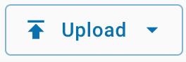
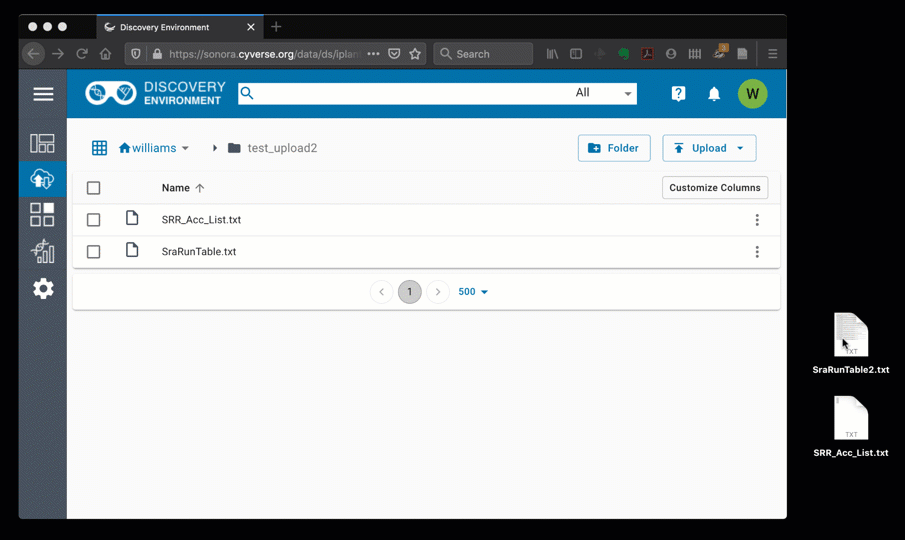

.. include:: cyverse_rst_defined_substitutions.txt
.. include:: custom_urls.txt

|CyVerse_logo|_

|Home_Icon|_
`Learning Center Home <http://learning.cyverse.org/>`_

Manage Data in Sonora Discovery Environment
-------------------------------------------

The Discovery Environment allows you to access, view, and manage your files in the CyVerse Data Store. You can upload smaller files, but for large files or large number of files, we recommend faster methods such as Cyberduck or iCommands. See documentation for those tools in our |Data Store Guide|.

----

*Upload / import small files in the Sonora Discovery Environment*
~~~~~~~~~~~~~~~~~~~~~~~~~~~~~~~~~~~~~~~~~~~~~~~~~~~~~~~~~~~~~~~~~~~~

1. In the navigation menu, click the **Data** button |data button| to access the data window in the Discovery Environment.

2. In the data window you will see a directory of files and folders in your Data Store. You may select a folder to be the destination for your uploaded file(s). You may also click the **Folder** button to create a new folder. If you do not select a destination, files will be uploaded to your home Data Store folder (i.e. iplant/home/CYVERSE_USERNAME)

3. Click the **Upload** button |upload button| to choose your options for importing files into the Discovery Environment:

    - To upload files from your local computer choose **Browse Local**;
      a file browser will open and you may select up to XXX files to upload
      (XXX MB Max)

    - To upload files available at a URL choose **Import by URL**;
      You may paste in a valid HTTP or FTP url. Then press **Import**. You may paste additional URLs or close this window by clicking **Done**.

  .. tip::

    When your data store file browser is open, you can also upload files from your computer by dragging them onto your browser window.

    |upload drag|

4. Once you have begun the upload, you will get a notification that files have been queued for upload. You may also view the status of an upload or import
by going back to the **Upload** button and choosing **View Upload Queue**.

   |upload queue|

   .. note::

     The Queue will only display the status of uploads from local files. Files imported by URL will generate a message in your notifications (bell icon, upper-left) when they have completed or if they fail.

----

**Fix or improve this documentation**

- Search for an answer:
  |CyVerse Learning Center|
- Ask us for help:
  click |Intercom| on the lower right-hand side of the page
- Report an issue or submit a change:
  |Github Repo Link|
- Send feedback: `learning@CyVerse.org <learning@CyVerse.org>`_

----

.. Comment: Place Images Below This Line
   use :width: to give a desired width for your image
   use :height: to give a desired height for your image
   replace the image name/location and URL if hyperlinked

 .. |Clickable hyperlinked image| image:: ./img/IMAGENAME.png
    :width: 500
    :height: 100
 .. _CyVerse logo: http://learning.cyverse.org/

 .. |Static image| image:: ./img/IMAGENAME.png
    :width: 25
    :height: 25

.. Comment: Place URLS Below This Line

   # Use this example to ensure that links open in new tabs, avoiding
   # forcing users to leave the document, and making it easy to update links
   # In a single place in this document

   .. |Substitution| raw:: html # Place this anywhere in the text you want a hyperlink

      <a href="REPLACE_THIS_WITH_URL" target="blank">Replace_with_text</a>

.. |Github Repo Link|  raw:: html

   <a href="FIX_FIX_FIX_FIX_FIX_FIX_FIX_FIX_FIX_FIX_FIX_FIX_FIX_FIX_FIX" target="blank">Github Repo Link</a>

.. |DE App| raw:: html

   

.. |Atmosphere Image| raw:: html

   

