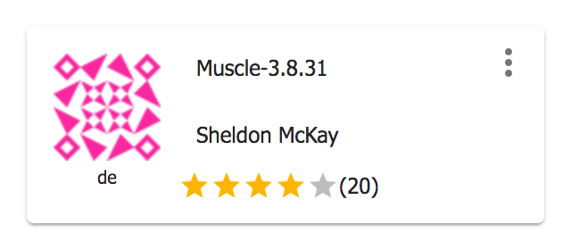
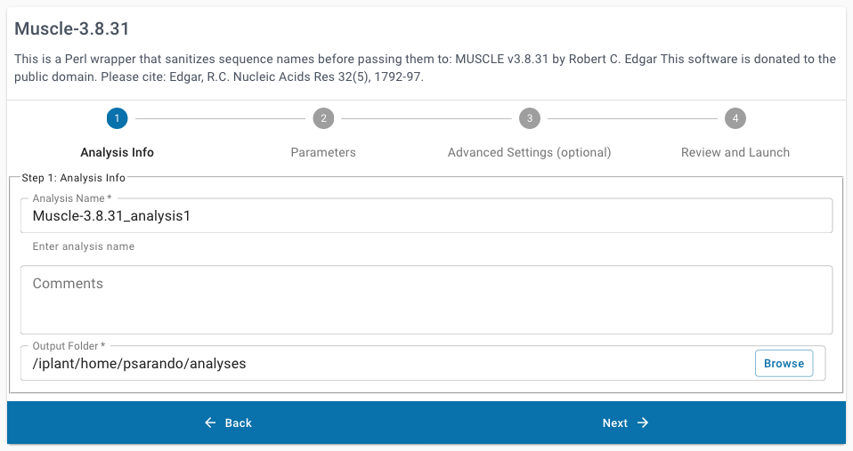
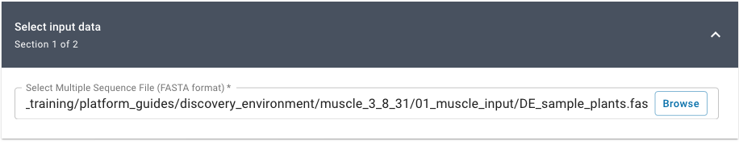
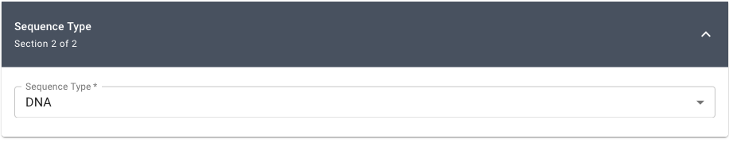
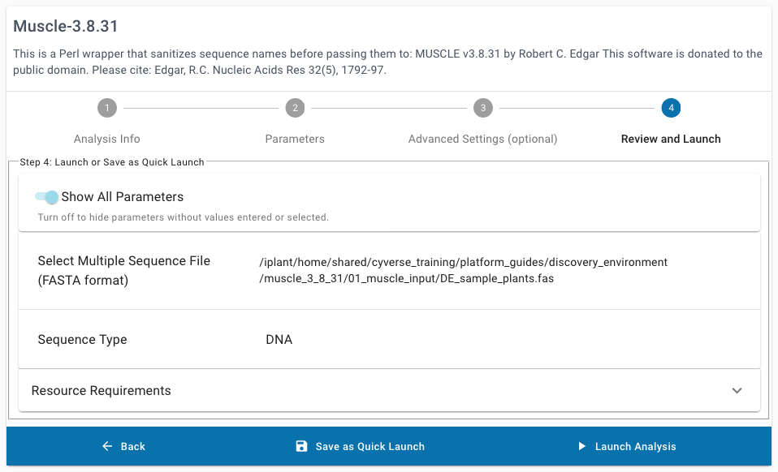

.. include:: cyverse_rst_defined_substitutions.txt
.. include:: custom_urls.txt

|CyVerse_logo|_

|Home_Icon|_
`Learning Center Home <http://learning.cyverse.org/>`_

Using Applications in the Discovery Environment
---------------------------------------------------

.. #### Comment: short description

When you are ready to analyze data, you can select from one of several hundred
applications in the Discovery Environment. We will cover the minimum you need to
launch an analysis using some sample data. In this example, we will use the **Muscle**
multiple sequence aligner app, to align some DNA sequences.

----

**Example Data**

.. list-table::
    :header-rows: 1

    * - Input
      - Description
      - Example
    * - Unaligned DNA sequence reads
      - One or more sequences in FASTA format
      - `DE_sample_plants.fas <http://datacommons.cyverse.org/browse/iplant/home/shared/cyverse_training/platform_guides/discovery_environment/muscle_3_8_31/01_muscle_input/DE_sample_plants.fas>`_

**Discovery Environment App(s):**

.. list-table::
    :header-rows: 1

    * - App name
      - Version
      - Description
      - App link
      - Notes/other links
    * - Muscle
      - 3.8.31
      - Multiple sequence aligner
      -	|muscle|
      -

.. Tip::
    Applications in the Discovery Environment **Apps** menu have several features:
    |de_app_tile|

    - |dots| **Dots**: Show additional links including *"Details"*, *"Add to Favorites"*,
      and *"Comments"*.
    - |info| **Details**: Information about the App including short description,
      user manual, number of successful analyses, date of last use,
      and URL link to App.
    - |favorite| **Add to Favorite**: Add to your list of favorite Apps.
    - |rating| **Rating**: Rate the app, and see current community rating
      (may indicate how many others liked the App, or found it useful).
    - |unavailable| **Unavailable**: App is disabled; may be outdated, unavailable due to maintenance.
      Contact support for help using these.
    - |beta| **Beta**: App is in beta testing (rate or leave feedback if you use!).
    - |private| **Private**: Application is not public and not visible by all users.

*Example Discovery Environment Analysis: Multiple sequence alignment with MUSCLE*
~~~~~~~~~~~~~~~~~~~~~~~~~~~~~~~~~~~~~~~~~~~~~~~~~~~~~~~~~~~~~~~~~~~~~~~~~~~~~~~~~~~~
1. If necessary, login to the |discovery environment|.

2. Click |apps_icon| **Apps** from the DE workspace; search for MUSCLE-3.8.31 or
   click this link: |muscle|.

3. Under "Analysis Info" leave the defaults or make any desired notes.

   |muscle_app_launch_info|

4. Under "Select Input data" click :guilabel:`&Browse`, then navigate to and select
   |de sample plants|; then click OK.

   (Location: Community Data > cyverse_training > platform_guides > discovery_environment > muscle_3_8_31 > **01_muscle_input**)

   |muscle_app_input_data|

5. Under "Sequence Type", select **DNA**.

   |muscle_app_seq_type|

6. Under the optional "Advanced Settings" leave the default settings.
   If required, some analyses may be launched with requests for more minimum
   `Resource Requirements <analyses_resource_reqs.html>`_,
   but this may cause those analyses to wait longer in the submission queue
   until a node that matches those minimum requirements becomes available.

7. Click :guilabel:`&Launch Analysis`

   |muscle_app_launch|

   You will receive a notification and be redirected to the Analyses Listing page.

----

**Fix or improve this documentation**

- Search for an answer:
  |CyVerse Learning Center|
- Ask us for help:
  click |Intercom| on the lower right-hand side of the page
- Report an issue or submit a change:
  |Github Repo Link|
- Send feedback: `learning@CyVerse.org <learning@CyVerse.org>`_

----

.. Comment: Place Images Below This Line

.. |comment| image:: ./img/sonora/comment.png
      :width: 30
      :height: 30

.. Comment: Place URLS Below This Line

.. |discovery environment| raw:: html

    <a href="https://de.cyverse.org/de/" target="_blank" rel="noopener">https://de.cyverse.org/de/</a>

.. |muscle| raw:: html

    <a href="https://de.cyverse.org/de/?type=apps&app-id=9b41c9e4-5031-4a49-b1cb-c471335df16e&system-id=de" target="_blank" rel="noopener">Muscle 3.8.31</a>

.. |de sample plants| raw:: html

    <a href="https://de.cyverse.org/de/?type=data&folder=/iplant/home/shared/cyverse_training/platform_guides/discovery_environment/muscle_3_8_31/01_muscle_input" target="_blank" rel="noopener">DE_sample_plants.fas</a>
